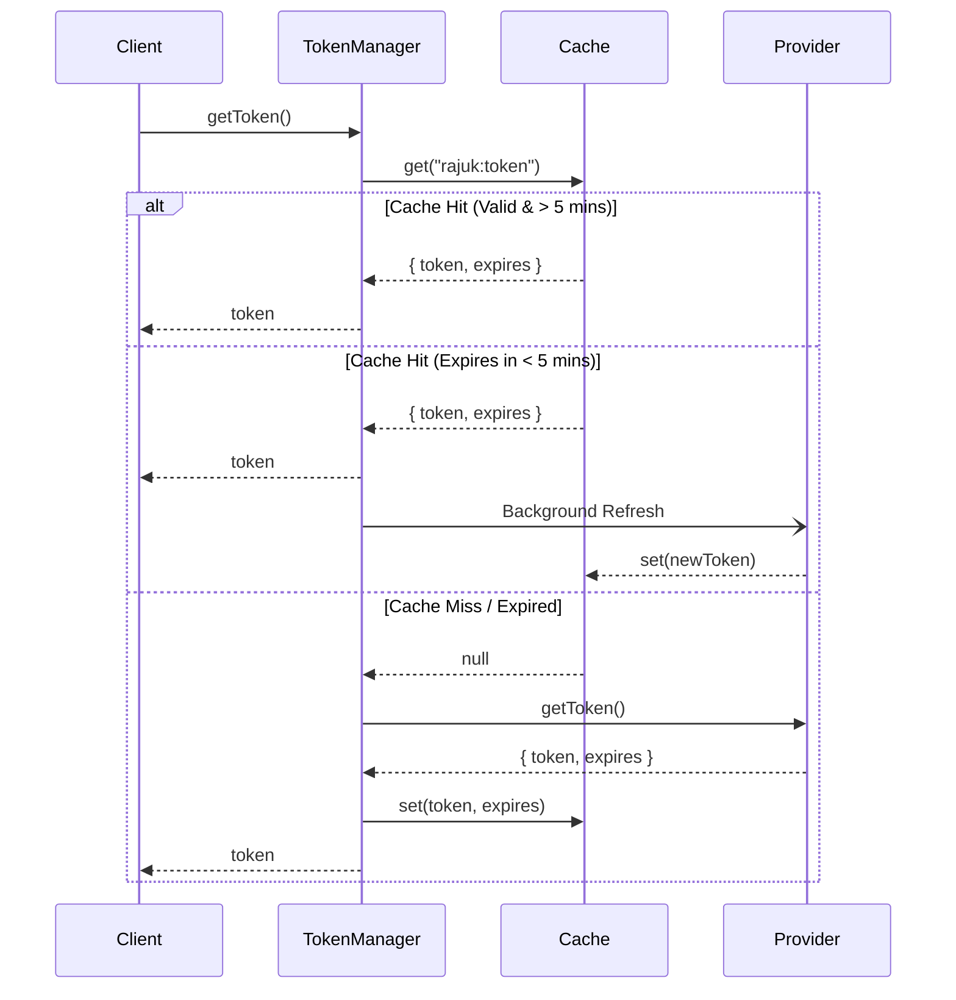
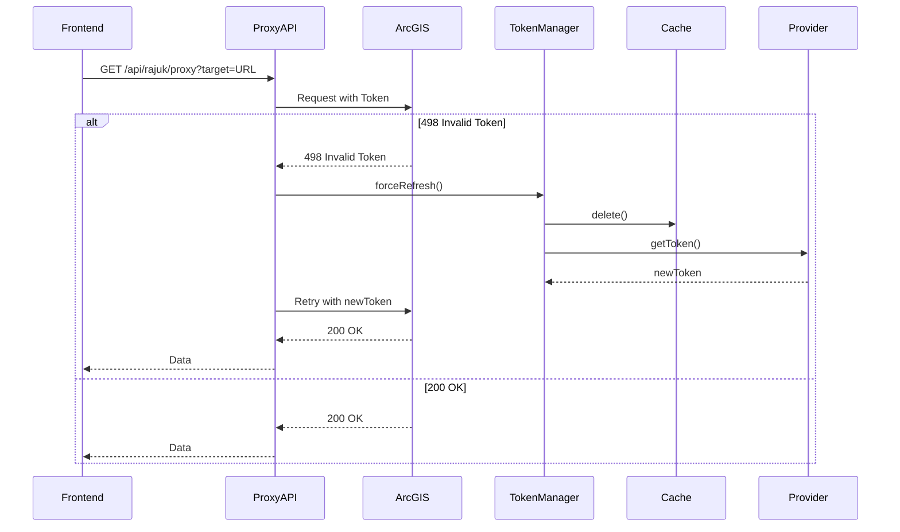

# Rajuk Integration Module Architecture

## Overview
The Rajuk Integration Module manages authentication and proxying to the ArcGIS server. Instead of hardcoding tokens or directly fetching from the client, this module provides a robust backend implementation that handles token generation, caching, background refreshing, and automatic retry on failure.

## Clean Architecture Layers

1. **API Layer (`app/api/rajuk/*`)**
   - Endpoints for token retrieval, health checking, and proxying.
   - Depends only on the Manager and Proxy abstractions.

2. **Manager Layer (`lib/rajuk/manager.ts` & `proxy.ts`)**
   - Contains the core business logic (`RajukTokenManager`).
   - Retrieves from Cache.
   - Refreshes tokens automatically when within `TOKEN_REFRESH_WINDOW` (e.g., 5 mins).
   - `proxy.ts` handles attaching tokens to external requests and retrying upon `498/499` responses.

3. **Cache Layer (`lib/rajuk/cache.ts`)**
   - Unified interface `CacheProvider`.
   - Supports Memory Map and Redis via `ioredis`. Auto-switches based on `REDIS_URL`.

4. **Provider Layer (`lib/rajuk/provider.ts`)**
   - The interface `TokenProvider` defines how a token should be obtained.
   - `OfficialRajukTokenProvider` connects to an official endpoint without scraping or bypassing authentication.

## Sequence Diagrams

### 1. Token Request (Cache Hit vs Miss)

### 2. Proxy with Auto-Retry

## Error Handling
Custom domain errors are defined in `lib/rajuk/errors.ts`:
- `RajukTokenExpiredError`
- `RajukProviderError`
- `RajukCacheError`
- `ProxyError`
